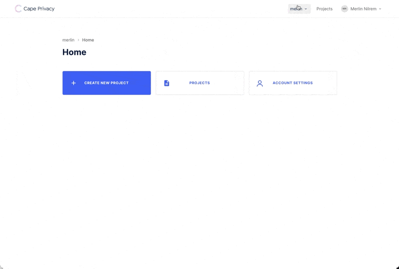
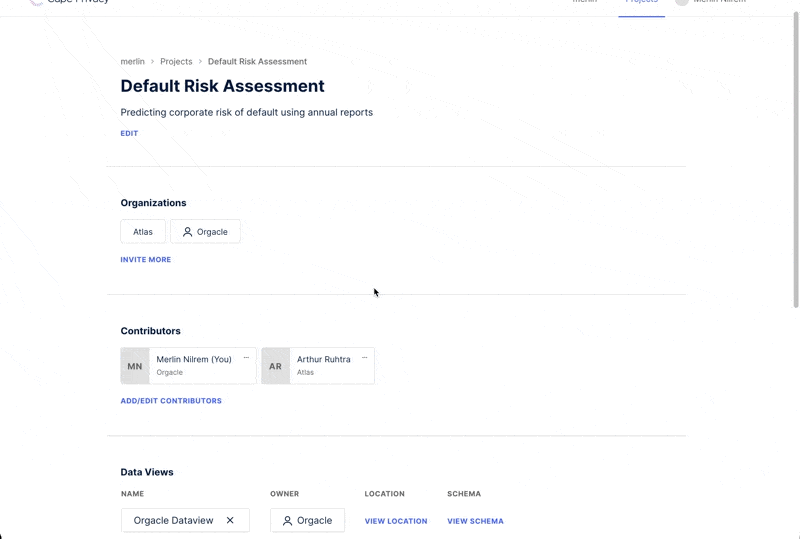
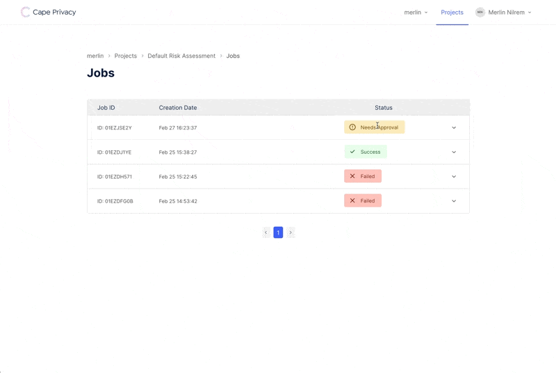
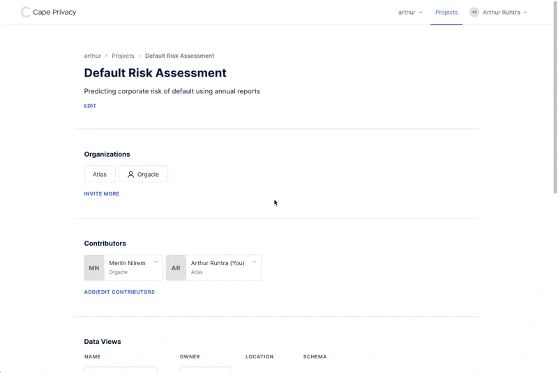

# Train a Linear Regression Model using Cape DataViews & Jobs

This tutorial will walk you through the process of training an encrypted linear regression model in collaboration with another organization using Cape Privacy. You'll learn how to:

- Register dataset pointers (i.e. DataViews) with Cape Cloud.
- Review DataViews from other organizations in your project.
- Approve and reject model computation jobs.
- View the metrics or weights of the trained model, depending on your role in the project.

We'll use the [Cape UI](https://demo.capeprivacy.com) to set up and review activity in the project. 

We'll also use the [`pytest`](https://github.com/capeprivacy/pytest) Python library to create and review pointers to datasets or [`DataViews`](/libraries/pycape/reference#pycapedataview), create [`Tasks`](/libraries/pycape/reference#pycapetask), which are Cape Python objects that contain instructions on how to train a model using the data provided, and review [`Jobs`](/libraries/pycape/reference#pycapejob) in order to track the status of the training, and view the results of the trained model.

## Project Setup

### Create an Organization

First you'll need to create an organization at [demo.capeprivacy.com](https://demo.capeprivacy.com).



Once you've created your organization, you can navigate to _Organization Settings_ and generate a token for your organization. You'll need this token to [configure your worker](/understand/architecture/cape-workers).


Take note of this value as you cannot recover it after you reload the page.

### Create a Project

Next, create a [`Project`](/libraries/pycape/reference#pycapeproject) within one of the organizations you just created.

`Projects` serve as the context in which you can define and review `Jobs` with other organizations.


Add organizations to your project in order to begin collaborating with them on training a model.


### Get a User Token

Finally, we will need a [user token](/understand/features/tokens/) to authenticate against `pycape`. Ensure you are
working within your user context and navigate to _Account Settings_ to create a token.


Take note of this value as, like the user token, you cannot recover it after you reload the page.

That is it for the UI for now! We'll return later to review `DataViews` and approve `Jobs`. 

Next we will set up these `DataViews` and `Jobs` in `pycape`.

## Working with the PyCape Python Library
### Login to PyCape

Before you can make requests to Cape Cloud, you'll need to authenticate with the API. Follow [these instructions to authenticate](/libraries/pycape/usage/login) with our API using `pycape`. Once you've logged in successfully, you should see a success message.

```python
>>> c = Cape()
>>> c.login()

Login successful
```

### Add a DataView to your project

Use the `list_projects` method defined on the main `Cape` class to query a list of projects that belong to your organization.

```python
>>> my_projects = c.list_projects()

PROJECT ID   NAME                     LABEL
-----------  -----------------------  -----------------------
project_123  Default Risk Assessment  default-risk-assessment

>>> my_projects

[Project(id=project_123, name=Default Risk Assessment, label=default-risk-assessment)]
```

To create a [`DataView`](/libraries/pycape/reference#pycapedataview) and add it to your project, simply call the `create_dataview` method defined on the `Project` class.

```python
>>> my_project = c.get_project(id="project_123")

>>> my_project.create_dataview(name="my-data", uri="s3://my-data.csv", owner_label="my-org")
```
All `DataViews` must be associated with an organization. This association can be made by passing either an `owner_label` or an `owner_id` to the `create_dataview` method.

!!! note
    Use the [`list_organizations`](/libraries/pycape/reference#pycape.api.project.project.Project.list_organizations) method defined on the `Project` class to get the metadata of the organizations collaborating on the project that you are a member of.

!!! note
    Unless your dataset is accessible via HTTP or you've [provided access to your S3 bucket](/libraries/pycape/usage/dataview#providing-s3-read-access-to-your-dataview) you'll need to [specify your schema](/libraries/pycape/usage/dataview#specifying-a-schema-for-your-dataview).

### Review Your Collaborator's DataView

Before we can submit a job to train our linear regression model, we'll need to review the `DataViews` added to the project by our collaborators.

Use the `list_dataviews` method defined on the `Project` class to inspect the name, owner (organization) and location of `DataViews` added to the project:

```python
>>> my_project = c.get_project(id="project_123")

>>> dataviews = my_project.list_dataviews()

DATAVIEW ID  NAME          LOCATION         OWNER
-----------  ------------  ---------------  -------------
01EY48       orgacle-data  s3://mydata.csv  orgacle (You)
01EY49       atlas-data                     atlas 
```

!!! note
    You'll only be able to see the locations or URIs of datasets that belong to your organization.

You can also inspect the schema of each `Dataview` in your project in order to see the data types of the columns, and to assess which data columns should be used to train the linear regression model.

```python
>>> dataviews[1].schema
{
    'debt equity ratio': 'number',
    'operating margin': 'number',
    'working capital': 'integer'
}
```

You can also review the dataviews added to your project in the UI.



### Submitting a Linear Regression Job

Now that we've added our own `DataView` to the project, and vetted the `DataView` of our collaborator, we are ready to submit our Cape linear regression job.

Pass the `DataView` that contains training data to `x_train_dataview`, and the `DataView` that contains the target values to `y_train_dataview`.

To specify which organization participating in the computation will own the results of the trained model, pass the ID of the intended organization to the `model_owner` parameter. You can view the IDs of organizations collaborating on the project using the [`list_organizations`](/libraries/pycape/reference#pycape.api.project.project.Project.list_organizations) method defined on the `Project` class. You must be a member of the organization to specify them as the `model_owner`.

You'll also need to specify the [S3 Bucket location that you would like Cape to save your model results to](/libraries/pycape/usage/job/#setting-the-storage-location-as-a-model-owner-in-cape).

```python
>>> dataview_1 = my_project.get_dataview(id="01EY48")
>>> dataview_2 = my_project.get_dataview(id="01EY49")

>>> vlr = VerticallyPartitionedLinearRegression(
>>>     x_train_dataview=dataview_1,
>>>     y_train_dataview=dataview_2,
>>>     model_location="s3://my-bucket",
>>>     model_owner="org_123",
>>> )

>>> my_project.submit_job(job=vlr)
```

You can specify which data columns the model should be trained on or evaluated against by passing the dataview to the [`VerticallyPartitionedLinearRegression`](/libraries/pycape/reference#pycapeverticallypartitionedlinearregression) class like so:

```python
>>> VerticallyPartitionedLinearRegression(
>>>     x_train_dataview=dataview_1["debt equity ratio"],
>>>     y_train_dataview=dataview_2["debt equity ratio"],
>>>     model_location="s3://my-bucket",
>>>     model_owner="org_123",
>>> )

VerticallyPartitionedLinearRegression(x_train_dataview=Orgacle Dataview['debt equity ratio'], y_train_dataview=Atlas Dataview['debt equity ratio'], model_location=s3://my-bucket)
```

!!!note
    In order for your linear regression job to train a model using Cape's encrypted learning protocol, you'll need to run your own Cape workers. Read [our documentation to get set up with Cape workers](/understand/architecture/cape-workers).

!!!note
    `VerticallyPartitionedLinearRegression` currently expects a bound on its input data in order to avoid precision loss during model training. See [its reference documentation](/reference/#pycapeverticallypartitionedlinearregression) for more details.

!!! note
    `DataView` indices must be aligned across parties before being used for a `VerticallyPartitionedLinearRegression`.

### Tracking Job Status

After submitting your job, you should be able to see the status and details of your `Job` in the UI.



To check the status of your submitted linear regression job using `pycape`, use the [`get_status`](/reference/#pycape.api.job.job.Job.get_status) method:
```python
>>> lr_job = my_project.get_job(id="abc_123")

>>> lr_job.get_status()
Success
```

### Approving Jobs

Before Cape can begin to train a linear regression model using the datasets submitted via `submit_job` method, both parties need to review and approve the Job.

To approve, you'll need to head over to the UI and navigate to your Job's details page. Once you've reviewed the details of your Job are correct, you can click "Approve Job" to let Cape know the job looks good on your end.



!!!note
    Before your job can run, both parties need to approve it.

### Getting Weights and Metrics from Trained Model

Once your job has successfully completed, you can view the results of the trained model. 

Whether you can view the weights or metrics of the trained model (or both!) depends on the role you and your organization play in the project.

To view the weights and metrics of a job, use the [`get_results`](/libraries/pycape/reference/#pycape.api.job.job.Job.get_results) method:

```python
>>> lr_job = my_project.get_job(id="abc_123")

>>> weights, metrics = lr_job.get_results()

>>> weights
array([12.14955139,  1.96560669])

>>> metrics
{'r_squared_result': [0.8804865768463074], 'mse_result': [37.94773864746094]}
```

If you are the model owner, the first value in the returned tuple will be populated with a numpy array of weights from your trained model. The first element in the `weights` array is the intercept of the linear model, and subsequent elements are its feature coefficients.

!!!note
    To access model weights you'll need to [inform **pycape** about your AWS IAM authentication credentials](/libraries/pycape/usage/job#accessing-weights-as-a-model-owner-in-cape).
