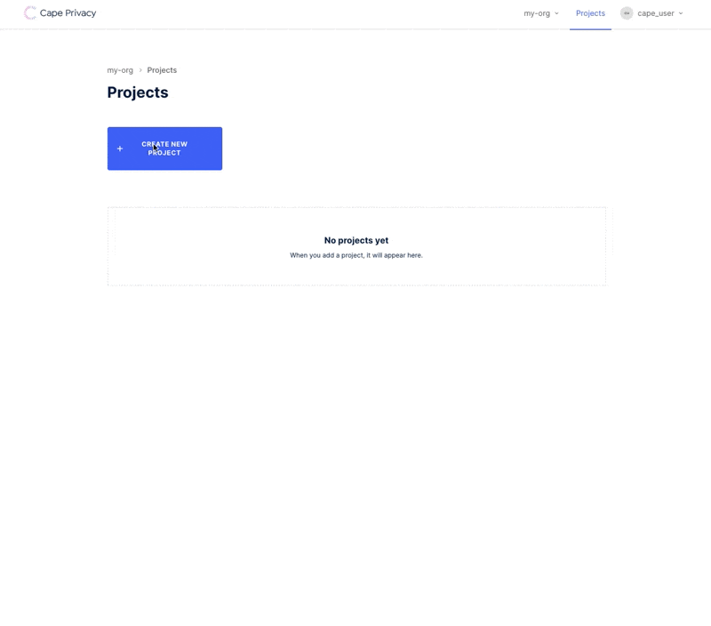

# Train a Linear Regression Model using Cape DataViews & Jobs

This tutorial will walk you through the process of training an encrypted linear regression model in collaboration with another organization using Cape Privacy. You'll learn how to:

- Send datasets securely to Cape Cloud
- Review the schemas of datasets belonging to collaborating organizations
- Approve and reject model computation jobs 
- View the metrics or weights of the trained model, depending on your role in the project

We'll use the [Cape UI](demo.capeprivacy.com) to setup and review actvity in the project. 

We'll also use the [`cape-ds`](https://github.com/capeprivacy/cape-ds) Python library to create and review pointers to datasets (`DataViews`), and create and review `Jobs`, Cape Python objects that tell () how to train a model using the data provided.
```
**TODO:** 
- Docs on project/task roles (/understand/features/roles/)
- Docs on org vs user tokens (/understand/features/tokens/)
- Docs on workers
```
## Project Setup

### Create an Organization

First you'll need to create an organization at demo.capeprivacy.com.


Once you've created your organization, you can navigate to _Organization Settings_ and generate a token for your organization. You'll need this token to configure your worker.

Take note of this value as you cannot recover it after you reload the page.

### Create a Project

Next, create a Project within one of the organizations you just created.

Projects serve as the context in which you can define and review `Jobs` with other organizations.



Add organizations to your project in order to begin collaborating with them on training a model.


### Get a User Token

Finally, we will need a user token to authenticate against `cape-ds`. Ensure you are
working within your user context and navigate to _Account Settings_ to create a token.


Take note of this value as, like the user token, you cannot recover it after you reload the page.

That is it for the UI for now, we'll return to later review and approve `DataViews` and `Jobs`. 

Next we will setup `DataViews` and `Jobs` in `cape-ds`.

### Login to Cape DS

Before you can make requests to Cape Cloud, you'll need to authenticate with the API. Follow the usage instructions [here](/usage/login). When you've logged in successfully, you should see a message.

```python
	>>> c = Cape()
    >>> c.login()

	Login successful
```

### Add a DataView to your project

Use the `list_projects` method defined on the main `Cape` class, to query a list of projects that belong to your organization.

```python
    >>> my_projects = c.list_projects()

    PROJECT ID   NAME                LABEL
    -----------  ------------------  ------------------
    project_123  Sales Transactions  sales-transactions

	>>> my_projects

	[Project(id=project_123, name=Sales Transactions, label=sales-transactions)]
```

Once you have the project you want to add a `DataView` to in-memory, you can initialize a `DataView` class and pass the instance to the `create_dataview` method.

```python
    my_project = c.get_project(id="project_123")

    data_view = DataView(name="my-data", uri="s3://my-data.csv", owner_label="my-org")
    my_project.create_dataview(data_view)
```
**TODO:** Add note about how you can find your org label.


```
**TODO:** 
- Add note about manually passong schema
- Look at another orgs dataview/schema
- Creating job
- Submitting job
- Approving job
- Getting job results
```