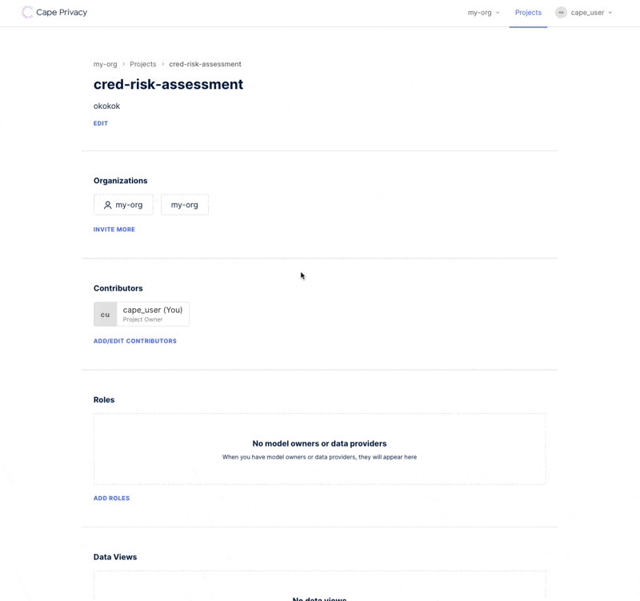
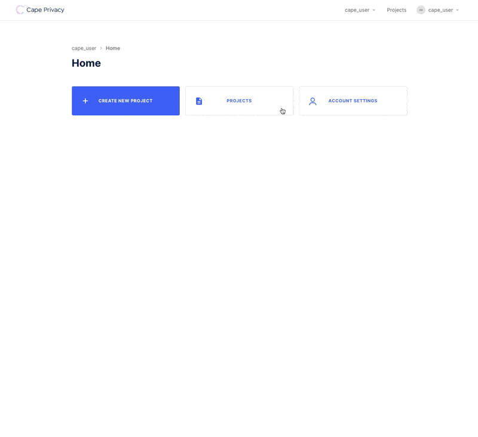

# Train a Linear Regression Model using Cape DataViews & Jobs

This tutorial will walk you through the process of training an encrypted linear regression model in collaboration with another organization using Cape Privacy. You'll learn how to:

- Send datasets securely to Cape Cloud
- Review the schemas of datasets belonging to collaborating organizations
- Approve and reject model computation jobs 
- View the metrics or weights of the trained model, depending on your role in the project

We'll use the [Cape UI](https://demo.capeprivacy.com) to setup and review actvity in the project. 

We'll also use the [`cape-ds`](https://github.com/capeprivacy/cape-ds) Python library to create and review pointers to datasets or [`DataViews`](/libraries/cape-ds/reference#dataview), and create and review [`Jobs`](/libraries/cape-ds/reference#job), Cape Python objects that contain instructions for how to train a model using the data provided.
```
**TODO:** 
- Docs on project/task roles (/understand/features/roles/)
- Docs on workers
```
## Project Setup

### Create an Organization

First you'll need to create an organization at [demo.capeprivacy.com](https://demo.capeprivacy.com).


Once you've created your organization, you can navigate to _Organization Settings_ and generate a token for your organization. You'll need this token to configure your worker.

Take note of this value as you cannot recover it after you reload the page.

### Create a Project

Next, create a [`Project`](/libraries/cape-ds/reference#project) within one of the organizations you just created.

`Projects` serve as the context in which you can define and review `Jobs` with other organizations.


Add organizations to your project in order to begin collaborating with them on training a model.



### Get a User Token

Finally, we will need a [user token](/understand/features/tokens/) to authenticate against `cape-ds`. Ensure you are
working within your user context and navigate to _Account Settings_ to create a token.



Take note of this value as, like the user token, you cannot recover it after you reload the page.

That is it for the UI for now! We'll return later to review and approve `DataViews` and `Jobs`. 

Next we will setup `DataViews` and `Jobs` in `cape-ds`.

### Login to Cape DS

Before you can make requests to Cape Cloud, you'll need to authenticate with the API. Follow [these instructions to authenticate](/libraries/cape-ds/usage/login) with our API using `cape-ds`. Once you've logged in successfully, you should see a success message.

```python
	>>> c = Cape()
    >>> c.login()

	Login successful
```

### Add a DataView to your project

Use the `list_projects` method defined on the main `Cape` class, to query a list of projects that belong to your organization.

```python
    >>> my_projects = c.list_projects()

    PROJECT ID   NAME                LABEL
    -----------  ------------------  ------------------
    project_123  Sales Transactions  sales-transactions

	>>> my_projects

	[Project(id=project_123, name=Sales Transactions, label=sales-transactions)]
```

Once you have the project in-memory that you want to add a `DataView` to, you can initialize a `DataView` class and pass the instance to the `add_dataview` method.

```python
    >>> my_project = c.get_project(id="project_123")

    
    >>> data_view = DataView(
    >>>     name="my-data", 
    >>>     uri="s3://my-data.csv", 
    >>>     owner_label="my-org"
    >>> )
    >>> my_project.add_dataview(data_view)
```
All `DataViews` must be associated with an organization. This association can be made by passing eiher an `owner_label` or an `owner_id` to the [`DataView`](/libraries/cape-ds/reference#cape.api.dataview.dataview.DataView.__init__) class instantiation.

**TODO:** Add note about how you can find your org label.

!!! note
    Unless your dataset is publically accessible, you'll need to [specify your schema](/libraries/cape-ds/usage/dataview#specifying-a-schema-for-your-dataview).

### Review Your Collaborator's DataView

Before we can submit a job to train our linear regression model, we'll need to review the `DataViews` added to the project by our collaborators.

Use the `list_dataviews` method defined on the `Project` class to inspect the name, owner (organization) and location of `DataViews` added to the project:

```python
    >>> my_project = c.get_project(id="project_123")

    >>> dataviews = my_project.list_dataviews()

    DATAVIEW ID  NAME           LOCATION         OWNER
    -----------  -------------  ---------------  -----------
    01EY48       armazorn-data  s3://mydata.csv  armazorn (You)
    01EY49       gorgle-data                     gorgle 
```

!!! note
    You'll only be able to see the locations or URIs of datasets that belong to your organization.

You can also inspect the schema of each dataview in your project in order to see the data types of the columns, and to assess which data columns should be used to train the linear regression model.

```python
    >>> dataviews[1].schema
    {
        'transaction_date': 'datetime', 
        'state': 'string', 
        'total_estimated_sales': 'integer'
    }
```
### Submitting a Linear Regression Job

Now that we've added our own `DataView` to the project, and vetted the `DataView` of our collaborator, we are ready to submit our Cape linear regression job.

Pass the `DataView` that contains training data to `x_train_dataview`, and the `DataView` that contains the target values to `y_train_dataview`.

```python
    >>> dataview_1 = my_project.get_dataview(id="01EY48")
    >>> dataview_2 = my_project.get_dataview(id="01EY49")

    >>> lr_job = VerticalLinearRegressionJob(
    >>>     x_train_dataview=dataview_1,
    >>>     y_train_dataview=dataview_2,
    >>> )
    >>> my_project.submit_job(job=lr_job)
```

You can also specify which data columns the model should be trained on or evaluated against by passing the dataview to the [`VerticalLinearRegressionJob`](/libraries/cape-ds/reference#verticallinearregressionjob) class like so:

```python
    >>> lr_job = VerticalLinearRegressionJob(
    >>>     x_train_dataview=dataview_1["x_total_estimated_sales"],
    >>>     y_train_dataview=dataview_2["y_total_estimated_sales"],
    >>> )
```

### Tracking Job Status

After submitting your job, you should be able to see the status and details of your `Job` in the UI.

**TODO:** Add GIF of Job/Job Details UI here.

To check the status of your submitted linear regression job, use the [`get_status`](/reference/#cape.api.job.job.Job.get_status) method:
```python
    >>> lr_job = my_project.get_job(id="abc_123")

    >>> lr_job.get_status()
    Success
```

### Approving Jobs

**TODO:** Need to know what the workflow is here.

### Getting Weights and Metrics from Trained Model

Once your job has successfully completed, you can view the results of the trained model. 

Whether you can view the weights or metrics of the trained model (or both!) depends on the role you and your organization play in the project.

**TODO:** Need to elaborate on project/task roles, link to seperate documentation about this.

To view the weights and metrics of a job, use the [`get_results`](/reference/#cape.api.job.job.Job.get_results) method:

```python
    >>> lr_job = my_project.get_job(id="abc_123")

    >>> weights, metrics = lr_job.get_results()

    >>> weights
    array([12.14955139,  1.96560669])

    >>> metrics
    {'r_squared_result': [0.8804865768463074], 'mse_result': [37.94773864746094]}
```