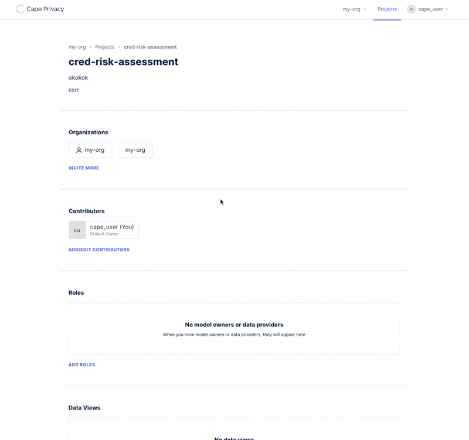
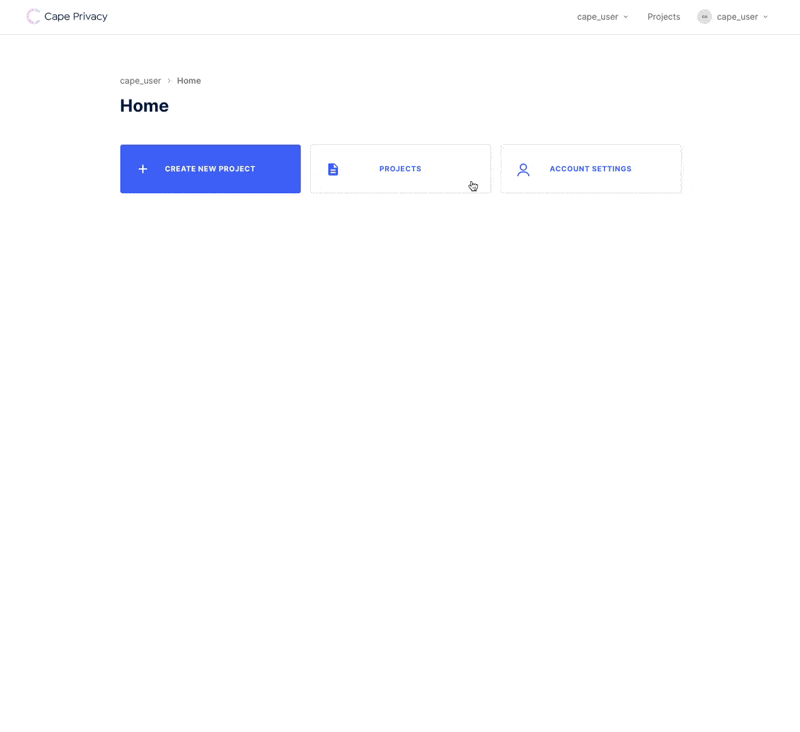

# Linear Regression

This example shows how you can run a linear regression example against cape. You will need to use the UI to setup
the beginnings of your project.

## Project Setup

### Create Organizations

To run a linear regression task, you must have two orgs to partake in the computation.

You can create an org using [cape-ui](https://github.com/capeprivacy/cape-ui) or your account on [demo.capeprivacy.com](https://demo.capeprivacy.com)


_repeat this process for a second org_.

### Create a Project

Next, create a project within one of the orgs you just created.


Then, add one of the other orgs you created.

 

### Get User & Org Tokens

Finally, we will need a user token to use with cape-ds. From the home page, ensure you are
working within your user context and navigate to settings to create a token.



Take note of this value as you cannot recover it after you reload the page.

That is it for the UI. We can use cape-ds for the rest of the tutorial.

### Cape-ds

[`liner_regression_project.py`](linear_regression/linear_regression_project.py). Provides the functionality needed
to create a linear regression task within your project.

Fill in the `token` variable at the top of the file from the token you generated in the previous step. 

At the bottom of the file, there are a few different functions you can call. 

First, we will just run `list_projects()`, E.g., convert the `main` block to 

```python
if __name__ == '__main__':
    list_projects()
    # get_project()
    # setup_project()
    # make_job()
```

Run this, and you will see output that looks something like

```
projects
	<Project (id=01EWG92FW5TKPGCG0WSPBAXRZC, name=linear-regression, label=linear-regression)>
	<Project (id=01EWK49HDBWKKXPZD2KHSP1EVW, name=cred-risk-assessment, label=cred-risk-assessment)>
```

Take note of the project ID (e.g. `01EWK49HDBWKKXPZD2KHSP1EVW` (yours will be different))

Replace the project_id field at the top of the file

From there, we can change the main block to setup the project and create tasks.

```python
if __name__ == '__main__':
    # list_projects()
    # get_project()
    setup_project()
    make_job()
```

This will add two data views to your project and create a task.

You can only add the data views to your project once, so from then on your main block should look like

```python
if __name__ == '__main__':
    # list_projects()
    # get_project()
    # setup_project()
    make_job()
```

### TODO

- Link to a tutorial showing how to run the task you created on a worker!